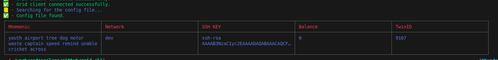

# TS GridCli

## Overview

**TS GridCli** is a command-line interface (CLI) tool designed to easily deploy virtual machines (VMs) on the **Threefold Grid**. The project is built on top of the **Grid Client**, allowing users to interact with the decentralized infrastructure of the Threefold Grid for virtual machine deployment, management, and other related functionalities.

## Features

TS GridCli offers multiple ways to deploy and manage virtual machines on the grid, including using YAML configuration files or command-line prompts. Key features include:

- **YAML-based Deployment**: Users can define deployment configurations in YAML files for easy VM setup.
- **Interactive Command-line Deployment**: Missing parameters can be filled interactively via prompts.
- **Flexible Command-line Options**: Users can provide parameters directly via CLI arguments, and the tool will prompt for any missing values.
- **Node Management**: The tool allows users to list and filter nodes based on various statuses (e.g., up, standby, down).

## Installation

1. Clone the repository:

    ```bash
      git clone https://github.com/Mahmoud-Emad/grid-cli.git
      cd grid-cli
    ```

2. Install the dependencies:

  ```bash
    npm install
  ```

3. Build and link the CLI tool:

    ```bash
    make build
    ```

## Usage

### YAML-based Deployment

You can deploy a virtual machine by providing [a YAML configuration file](./deployment-example.yaml) like the following:

```yaml
name: testdeployment
network:
  name: wedtest
  ip_range: "10.10.0.0/16"
machines:
  - name: testvm
    node_id: 11
    disks:
      - name: wedDisk
        size: 8
        mountpoint: /testdisk
    public_ip: false
    public_ip6: false
    planetary: true
    mycelium: false
    cpu: 1
    memory: 2048 # 2GB
```

To deploy the machine defined in the YAML file, run the following command:

```bash
grid-cli vms deploy --deployment-file path/to/your/deployment.yaml
```

### Command-line-based Deployment

You can also deploy a virtual machine by specifying options directly through the CLI:

```bash
grid-cli vms deploy --network-name="customnetwork" --machine-name="myvm" --node-id=11 --memory=5 --cpu=1 --disk-name="zeko"
```

Any missing values will be prompted interactively.

### Commands

#### `whoami`

Prints the current connected wallet information, including network, balance, SSH key, and more.

```bash
grid-cli whoami
```

Example output:


#### `connect`

Prompts for wallet secret, SSH key, and the network (e.g., dev, qa, test, main).

```bash
grid-cli connect
```

#### `nodes`

Lists the available nodes on the Threefold Grid. You can filter nodes by status, such as `up`, `standby`, or `down`.
PS: Additional filter options will be supported soon.

```bash
grid-cli nodes --status="up"
```

#### `vms`

Manages virtual machines. Currently, only the `deploy` subcommand is available, but in the future, the `list`, `get`, and `delete` subcommands will be added.

##### Deploy

Deploy a virtual machine either through a YAML configuration file or by using command-line arguments:

```bash
grid-cli vms deploy --deployment-file path/to/deployment.yaml
```

Or:

```bash
grid-cli vms deploy --network-name="customnetwork" --machine-name="myvm" --node-id=11 --memory=5 --cpu=1 --disk-name="zeko"
```

### Future Features

- **List VMs**: List all deployed virtual machines.
- **Get VM**: Retrieve details of a specific VM.
- **Delete VM**: Remove a deployed VM from the grid.

---

### Example Use Cases

1. **Deploy via YAML**:

   ```bash
   grid-cli vms deploy --deployment-file path/to/deployment.yaml
   ```

2. **Interactive CLI Deployment**:

   ```bash
   grid-cli vms deploy --network-name="customnetwork"
   ```

   (The CLI will prompt for the remaining required inputs)

3. **Query Nodes**:

   ```bash
   grid-cli nodes --status="up"
   ```

4. **Check Connected Wallet**:

   ```bash
   grid-cli whoami
   ```

5. **Connect Another Wallet**:

   ```bash
   grid-cli connect
   ```
